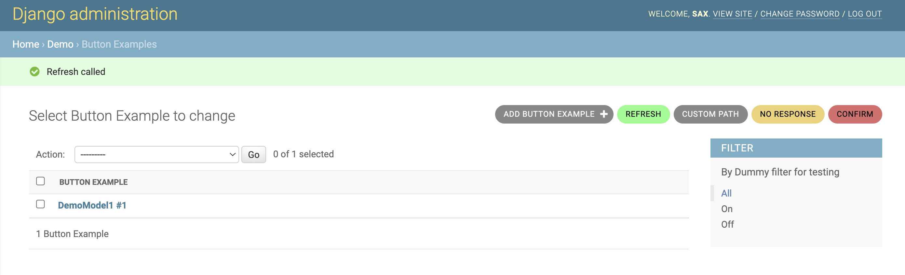

 django-admin-extra-buttons
==========================


[](https://badge.fury.io/py/django-admin-extra-buttons)
[](https://codecov.io/github/saxix/django-admin-extra-buttons?branch=develop)
[](https://github.com/saxix/django-admin-extra-buttons/actions/workflows/test.yml)
[](https://saxix.github.io/django-admin-extra-buttons/)
[](https://pypi.org/project/django-admin-extra-buttons/)
[](https://pypi.org/project/django-admin-extra-buttons/)




This is a full rewriting of the original `django-admin-extra-url`. It
provides decorators to easily add custom buttons to Django Admin pages and/or add views to any ModelAdmin

It allows easy creation of wizards, actions and/or links to external resources
as well as api only views.

Four decorators are available:

- [@button()][] to mark a method as extra view and show related button
- [@link()][] This is used for "external" link, where you don't need to invoke local views.
- [@view()][] View only decorator, this adds a new url but do not render any button.
- [@choice()][] Menu like button, can be used to group multiple @views().


How to use it
-------------
```python


```

[//]: # ()
[//]: # ()
[//]: # (```python)

[//]: # ()
[//]: # (from admin_extra_buttons.api import ExtraButtonsMixin, button, confirm_action, link, view)

[//]: # (from admin_extra_buttons.utils import HttpResponseRedirectToReferrer)

[//]: # (from django.http import HttpResponse, JsonResponse)

[//]: # (from django.contrib import admin)

[//]: # (from django.views.decorators.clickjacking import xframe_options_sameorigin)

[//]: # (from django.views.decorators.csrf import csrf_exempt)

[//]: # ()
[//]: # ()
[//]: # (class MyModelModelAdmin&#40;ExtraButtonsMixin, admin.ModelAdmin&#41;:)

[//]: # ()
[//]: # (    @button&#40;permission='demo.add_demomodel1',)

[//]: # (            visible=lambda self: self.context["request"].user.is_superuser,)

[//]: # (            change_form=True,)

[//]: # (            html_attrs={'style': 'background-color:#88FF88;color:black'}&#41;)

[//]: # (    def refresh&#40;self, request&#41;:)

[//]: # (        self.message_user&#40;request, 'refresh called'&#41;)

[//]: # (        # Optional: returns HttpResponse)

[//]: # (        return HttpResponseRedirectToReferrer&#40;request&#41;)

[//]: # ()
[//]: # (    @button&#40;html_attrs={'style': 'background-color:#DC6C6C;color:black'}&#41;)

[//]: # (    def confirm&#40;self, request&#41;:)

[//]: # (        def _action&#40;request&#41;:)

[//]: # (            pass)

[//]: # ()
[//]: # (        return confirm_action&#40;self, request, _action, "Confirm action",)

[//]: # (                              "Successfully executed", &#41;)

[//]: # ()
[//]: # (    @link&#40;href=None,)

[//]: # (          change_list=False,)

[//]: # (          html_attrs={'target': '_new', 'style': 'background-color:var&#40;--button-bg&#41;'}&#41;)

[//]: # (    def search_on_google&#40;self, button&#41;:)

[//]: # (        original = button.context['original'])

[//]: # (        button.label = f"Search '{original.name}' on Google")

[//]: # (        button.href = f"https://www.google.com/?q={original.name}")

[//]: # ()
[//]: # (    @view&#40;&#41;)

[//]: # (    def select2_autocomplete&#40;self, request&#41;:)

[//]: # (        return JsonResponse&#40;{}&#41;)

[//]: # ()
[//]: # (    @view&#40;http_basic_auth=True&#41;)

[//]: # (    def api4&#40;self, request&#41;:)

[//]: # (        return HttpResponse&#40;"Basic Authentication allowed"&#41;)

[//]: # ()
[//]: # (    @view&#40;decorators=[csrf_exempt, xframe_options_sameorigin]&#41;)

[//]: # (    def preview&#40;self, request&#41;:)

[//]: # (        if request.method == "POST":)

[//]: # (            return HttpResponse&#40;"POST"&#41;)

[//]: # (        return HttpResponse&#40;"GET"&#41;)

[//]: # ()
[//]: # ()
[//]: # (```)

[//]: # ()
[//]: # (#### Project Links)

[//]: # ()
[//]: # ()
[//]: # (- Code: https://github.com/saxix/django-admin-extra-buttons)

[//]: # (- Documentation: https://saxix.github.io/django-admin-extra-buttons/)

[//]: # (- Issue Tracker: https://github.com/saxix/django-admin-extra-buttons/issues)

[//]: # (- Download Package: https://pypi.org/project/django-admin-extra-buttons/)
